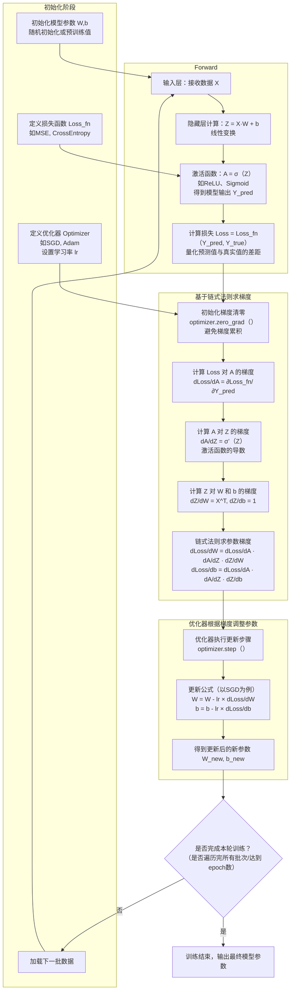

```mermaid
flowchart TD
    subgraph init[初始化阶段]
        A[初始化模型参数 W,b<br/>随机初始化或预训练值]
        B[定义损失函数 Loss_fn<br/>如MSE, CrossEntropy]
        C[定义优化器 Optimizer<br/>如SGD, Adam<br/>设置学习率 lr]
        D[加载单批次数据<br/>输入 X: （batch_size, in_dim）<br/>标签 Y_true: （batch_size, out_dim）]
    end

    A --> E
    B --> G
    C --> I
    D --> E

    subgraph 1. 前向传播[Forward]
        E[输入层：接收数据 X]
        F[隐藏层计算：Z = X·W + b<br/>线性变换]
        G[激活函数：A = σ（Z）<br/>如ReLU、Sigmoid<br/>得到模型输出 Y_pred]
        H[计算损失 Loss = Loss_fn（Y_pred, Y_true）<br/>量化预测值与真实值的差距]
    end

    E --> F
    F --> G
    G --> H

    subgraph 2. 反向传播Backward[基于链式法则求梯度]
        H --> I[初始化梯度清零<br/>optimizer.zero_grad（）<br/>避免梯度累积]
        I --> J[计算 Loss 对 A 的梯度<br/>dLoss/dA = ∂Loss_fn/∂Y_pred]
        J --> K[计算 A 对 Z 的梯度<br/>dA/dZ = σ’（Z）<br/>激活函数的导数]
        K --> L[计算 Z 对 W 和 b 的梯度<br/>dZ/dW = X^T, dZ/db = 1]
        L --> M[链式法则求参数梯度<br/>dLoss/dW = dLoss/dA · dA/dZ · dZ/dW<br/>dLoss/db = dLoss/dA · dA/dZ · dZ/db]
    end

    subgraph 3. 参数更新Update[优化器根据梯度调整参数]
        M --> N[优化器执行更新步骤<br/>optimizer.step（）]
        N --> O[更新公式（以SGD为例）<br/>W = W - lr × dLoss/dW<br/>b = b - lr × dLoss/db]
        O --> P[得到更新后的新参数 W_new, b_new]
    end

    P --> Q{是否完成本轮训练？<br/>（是否遍历完所有批次/达到epoch数）}
    Q -->|否| D[加载下一批数据]
    Q -->|是| R[训练结束，输出最终模型参数]
```