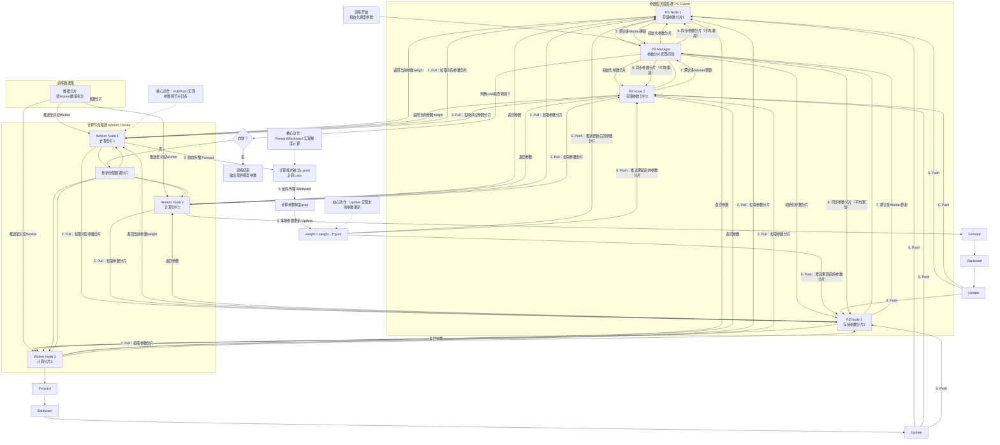

**整体流程**：计算节点会**pull**参数，然后**ps**返回参数，然后计算节点开始前向计算**loss**，反向计算梯度**grad**，然后**push**，最后 ps 根据梯度和优化器**update**更新参数。

注：
- **数据分片阶段**：按批次动态分片（先获取总批次数据(batch_size * worker)→分片→执行→下一轮再取新批次）
- **计算阶段**：在计算节点 **update** 完向 **ps** 节点 **push** 参数时，是向 **pull** 参数的节点 **push** 而不是所有 **ps** 节点。
- **聚合多 worker 更新**：同一个参数分片可能会被多个 Worker 同时更新。，此时，PS Manager 会让负责该参数分片的 PS 节点，对所有 Worker 推送的同一份参数更新执行聚合运算，生成一个全局最优的更新值。（常见聚合策略：梯度平均，参数加权平均，累加更新）
- **同步参数分片**：按需同步，不是全量复制。同步的参数属于 备份/迁移 副本。常见的两种同步场景：
  - **高可用备份**：防止参数归属的 PS 节点宕机，导致参数丢失。
    1. PS Manager 让 某个 ps 节点 把最新的 参数，同步一份只读备份到 另一个ps节点，备份节点（PS3）不参与正常的 Pull/Push，
    2. 只有当 PS1 宕机时，PS Manager 才会更新映射表，让 Worker 改从 PS3 拉取参数。
  - **负载均衡迁移同步**：解决 PS 节点负载不均（比如 PS1 存储的参数太多，计算压力大）。操作如下：
    1. PS Manager 决定把conv1.weight从 PS1 迁移到 PS2。
    2. PS1 将最新的conv1.weight同步到 PS2
    3. PS Manager 向所有 Worker 推送更新后的映射表（conv1.weight → PS2）
    4. 下一轮训练，Worker 就会改向 PS2 拉取这个参数，PS1 不再负责该参数。